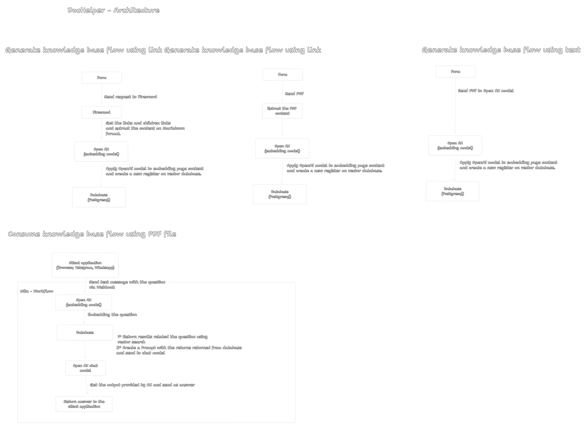

# [EN VERSION]

## About

The dochelper.ai is tool using ai to make simple final user search info on your website or documentation from your product. But is not only good to 
the final user is simply to the company add new info to the AI about new products, features or extra info.

## Use case

- Documentation from your production
- Chatbot agent to answer common question about the production on Website
- Chatbot agent to help the internal team from the company. PS: propability you know or you are a guy has a specific knowledge about some process or wait to execute
  something, so you can transfer that knowledge to chatbot that way you don't need to bottle or lose time wait the person answer some.

## Technologies:

- FireCrawl(extract children links from the page and extract content from the page without problem like: recaptcha, ip blocker or something else)
- OpenAI(embedding model and chat model).
- Supabase + Postgresql(RAG Retrieval-augmented generation).
- N8N workflow where play as agent to answer questions about the product or service.

## How to use

- Download the file named **Dochelper___Simple_chatbot_support___AI___RAG___Firecrawl.json**
- Access N8N
- Create a new workflow and import the file from 1º step.
- Active the workflow

## Architecture

# [PT VERSION]

## Sobre

O dochelper.ai é uma ferramenta que utiliza IA para facilitar a busca de informações pelo usuário final no seu site ou na documentação do seu produto. Mas não é apenas útil para o usuário final — também é simples para a empresa adicionar novas informações à IA sobre novos produtos, funcionalidades ou detalhes extras.

## Casos de uso

- Documentação do seu produto  
- Chatbot para responder perguntas frequentes sobre o produto no site  
- Chatbot para ajudar a equipe interna da empresa. Obs.: provavelmente você conhece ou é a pessoa que tem um conhecimento específico sobre algum processo ou que precisa aguardar para executar algo; assim, você pode transferir esse conhecimento para o chatbot, evitando gargalos ou perda de tempo esperando a resposta da pessoa.  

## Tecnologias:

- FireCrawl (extrai links filhos da página e também o conteúdo, sem problemas como: recaptcha, bloqueio de IP ou outros)  
- OpenAI (modelo de embeddings e modelo de chat)  
- Supabase + PostgreSQL (RAG — Retrieval-augmented generation)  
- N8N workflow que atua como agente para responder perguntas sobre o produto ou serviço.  

## Como usar

- Baixar o arquivo chamado **Dochelper___Simple_chatbot_support___AI___RAG___Firecrawl.json**
- Acessar N8N
- Criar um novo workflow e importa o arquivo do 1º passo.
- Ativar o workflow

## Arquitetura

